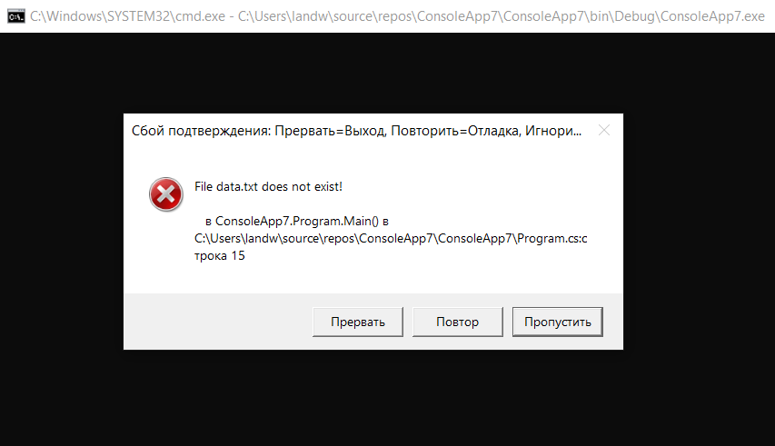

# Диагностика [↩︎](/trainings)

Когда что-то пошло не так, важно иметь доступ к информации, которая поможет в диагностировании проблемы. Существенную помощь в этом оказывает интегрированная среда разработки или отладчик, но он обычно доступен только на этапе разработки. После поставки приложение обязано самостоятельно собирать и фиксировать диагностическую информацию.

<a name="0"/>**Содержание**

1. [Условная компиляция](#1)  
2. [Классы Debug и Trace](#2)
3. [Интеграция с отладчиком](#3)
4. [Процессы и потоки процессов](#4)
5. [StackTrace и StackFrame](#5)
6. [Журналы событий Window](#6)
7. [Счетчики производительности](#7)
8. [Класс Stopwatch](#8)

---

## <a name="1"/>1. Условная компиляция [↩︎](#0)

С помощью директив препроцессора любой раздел кода C# можно компилировать условно. Директивы препроцессора представляют собой специальные инструкции для компилятора, которые начинаются с символа `#` (и в отличие от других конструкций C# должны полностью располагаться в одной строке). Логически они выполняются перед основной компиляцией (хотя на практике компилятор обрабатывает их во время фазы лексического анализа). Директивами препроцессора для условной компиляции являются `#if`, `#else`, `#endif` и `#elif`.

Директива `#if` указывает компилятору на необходимость игнорирования раздела кода, если не определен специальный символ. Определить такой символ можно либо с помощью директивы `#define`, либо посредством ключа компиляции.

```csharp
#define TESTMODE
static void Main()
{
#if TESTMODE
	Console.WriteLine("TESTMODE!");
#else 
	Console.WriteLine("NOT TESTMODE!");
#endif
}
```

Для определения символа на уровне сборки укажите при запуске компилятора ключ `/define`:

```csc Program.cs /define:TESTMODE,PLAYMODE```

Среда Visual Studio позволяет вводить символы условной компиляции в окне свойств проекта. Если вы определили символ на уровне сборки и затем хотите отменить его определение для какого-то файла, тогда применяйте директиву `#undef`.


### 1.1. Почему выбирают условную компиляцию?

Условная компиляция способна решать задачи, которые нельзя решить посредством переменных-флагов, например:
- условное включение атрибута;
- изменение типа, объявляемого для переменной;
- переключение между разными пространствами имен или псевдонимами типов в директиве `using`:
  ```csharp
  using TestType =
  #if V2
  MyCompany.Widgets.GadgetV2;
  #else
  MyCompany.Widgets.Gadget;
  #endif
  ```

### 1.2. Атрибут Conditional

Атрибут `Conditional` указывает компилятору на необходимость игнорирования любых обращений к определенному классу или методу, если заданный символ не был определен.

```csharp
static void LogStatus(string msg)
{
  string logFilePath = . . .
  System.IO.File.AppendAllText(logFilePath, msg + "\r\n");
}
---
#if LOGGINGMODE // Постоянно писать такой код утомительно
  LogStatus ("Message Headers: " + GetMsgHeaders());
#endif
---
[Conditional("LOGGINGMODE")] // Идеальное решение
static void LogStatus(string msg)
{
  ...
}
```

В результате компилятор трактует вызовы `LogStatus`, как если бы они были помещены внутрь директивы `#if LOGGINGMODE`. Когда символ не определен, любые обращения к методу `LogStatus` полностью исключаются из компиляции, в том числе и выражения оценки его аргумента.

### 1.3. Альтернатива атрибуту Conditional

Атрибут `Conditional` бесполезен, когда во время выполнения необходима возможность динамического включения или отключения функциональности: вместо него должен применяться подход на основе переменных. Остается открытым вопрос о том, как элегантно обойти оценку аргументов при вызове условных методов регистрации. Проблема решается с помощью функционального подхода:

```csharp
class Program
{
  public static bool EnableLogging;
  static void LogStatus(Func<string> message)
  {
    string logFilePath = ...
    if (EnableLogging)
      System.IO.File.AppendAllText(logFilePath, message() + "\r\n");
  }
}
---
LogStatus(() => "Message Headers: " + GetComplexMessageHeaders());
```

Если значение `EnableLogging` равно `false` , тогда вызов метода `GetComplexMessageHeaders` никогда не оценивается.

## <a name="2"/>2. Классы Debug и Trace [↩︎](#0)

`Debug` и `Trace` – статические классы, которые предлагают базовые возможности регистрации и утверждений. Указанные два класса очень похожи; основное отличие связано с тем, для чего они предназначены. Класс `Debug` предназначен для отладочных сборок, а класс `Trace` – для отладочных и окончательных сборок. Чтобы достичь таких целей:

- все методы класса `Debug` определены с атрибутом `[Conditional ("DEBUG")]`;
- все методы класса `Trace` определены с атрибутом `[Conditional ("TRACE")]`.

Все обращения к `Debug` или `Trace` исключаются компилятором, если только не определен символ `DEBUG` или `TRACE`. 

По умолчанию в Visual Studio определены оба символа, `DEBUG` и `TRACE`, в конфигурации отладки и один лишь символ `TRACE` в конфигурации выпуска.

Классы `Debug` и `Trace` предоставляют методы `Write`, `WriteLine` и `WriteIf` . По умолчанию они отправляют сообщения в окно вывода отладчика:

```csharp
Debug.Write("Data");
Debug.WriteLine(23 * 34);
int x = 5, y = 3;
Debug.WriteIf(x > y, "x is greater than y");
```

Класс `Trace` также предлагает методы `TraceInformation`, `TraceWarning` и `TraceError`. Отличия в поведении между ними и методами `Write` зависят от активных прослушивателей `TraceListener` (см. далее).


### 2.1. Методы Fail и Assert

Классы `Debug` и `Trace` предоставляют методы `Fail` и `Assert`. Метод `Fail` отправляет сообщение каждому экземпляру `TraceListener` из коллекции `Listeners` внутри класса `Debug` или `Trace` (как будет показано далее), которые по умолчанию записывают переданное сообщение в вывод отладки, а также отображают его в диалоговом окне:

```csharp
Debug.Fail("File data.txt does not exist!");
```

В открывшемся диалоговом окне предлагается выбрать дальнейшее действие: игнорировать, прервать или повторить. Последнее действие затем позволяет присоединить отладчик, что удобно для более точного диагностирования проблемы.

  
Рис. 1. Сообщение об ошибке

Метод `Assert` просто вызывает метод `Fail`, если аргумент типа `bool` равен `false`; это называется созданием утверждения и указывает на ошибку в коде, если оно нарушено. Можно также задать необязательное сообщение об ошибке:

```csharp
Debug.Assert(File.Exists ("data.txt"), "File data.txt does not exist!");
```

Методы `Write`, `Fail` и `Assert` также перегружены, чтобы вдобавок к сообщению принимать строковую категорию, которая может быть полезна при обработке вывода.

### 2.2. TraceListener

Классы `Debug` и `Trace` имеют свойство `Listeners`, которое является статической коллекцией экземпляров `TraceListener`.  Они отвечают за обработку содержимого, выдаваемого методами `Write`, `Fail` и `Assert`.

По умолчанию коллекция `Listeners` в обоих классах включает единственный прослушиватель (`DefaultTraceListener`). Стандартный прослушиватель обладает двумя основными возможностями.
- В случае подключения к отладчику наподобие встроенного в Visual Studio сообщения записываются в окно вывода отладки; иначе содержимое сообщения игнорируется.
- Когда вызывается метод `Fail` (или утверждение не выполняется), отображается диалоговое окно, предлагающее пользователю выбрать дальнейшее действие – продолжить, прервать или повторить (присоединение/отладку) – независимо от того, подключен ли отладчик.

Вы можете изменить такое поведение, (необязательно) удалив стандартный прослушиватель и затем добавив один или большее число собственных прослушивателей. Прослушиватели трассировки можно написать с нуля (создавая подкласс класса `TraceListener`) или воспользоваться одним из предопределенных типов:
- `TextWriterTraceListener` записывает в `Stream` или `TextWriter` либо добавляет в файл;
- `EventLogTraceListener` записывает в журнал событий Windows;
- `EventProviderTraceListener` записывает в подсистему трассировки событий для Windows (Event Tracing for Windows – ETW) в Windows Vista и последующих версиях;
- `WebPageTraceListener` записывает на веб-страницу ASP.NET.

> Ни один из перечисленных выше прослушивателей не отображает диалоговое окно, когда вызывается метод `Fail` – таким поведением обладает только класс `DefaultTraceListener`.

В следующем примере очищается стандартный прослушиватель `Trace`, после чего добавляются три прослушивателя – первый дописывает в файл, второй выводит на консоль и третий записывает в журнал событий Windows:

```csharp
// Очистить стандартный прослушиватель:
Trace.Listeners.Clear();
// Добавить средство записи, дописывающее в файл trace.txt:
Trace.Listeners.Add(new TextWriterTraceListener("trace.txt"));

// Получить выходной поток Console и добавить его в качестве прослушивателя:
System.IO.TextWriter tw = Console.Out;
Trace.Listeners.Add(new TextWriterTraceListener(tw));

// Настроить исходный файл журнала событий и создать/добавить прослушиватель.
// Метод CreateEventSource требует повышения полномочий до уровня
// администратора, так что это обычно будет делаться при установке приложения.
if (!EventLog.SourceExists("DemoApp"))
EventLog.CreateEventSource("DemoApp", "Application");
Trace.Listeners.Add(new EventLogTraceListener("DemoApp"));
```

В случае журнала событий Windows сообщения, записываемые с помощью метода `Write`, `Fail` или `Assert`, всегда отображаются в программе «Просмотр событий» как сообщения уровня сведений. Однако сообщения, которые записываются посредством методов `TraceWarning` и `TraceError`, отображаются как предупреждения или ошибки.

Класс `TraceListener` также имеет свойство `Filter` типа `TraceFilter`, которое можно устанавливать для управления тем, будет ли сообщение записано данным прослушивателем. Чтобы сделать это, нужно либо создать экземпляр одного из предопределенных подклассов (`EventTypeFilter` или `SourceFilter`) , либо создать подкласс класса `TraceFilter` и переопределить метод `ShouldTrace`. Подобный прием можно использовать, скажем, для фильтрации по категории.

В классе `TraceListener` также определены свойства `IndentLevel` и `IndentSize` для управления отступами и свойство `TraceOutputOptions` для записи дополнительных данных:

```csharp
TextWriterTraceListener tl = new TextWriterTraceListener (Console.Out);
tl.TraceOutputOptions = TraceOptions.DateTime | TraceOptions.Callstack;
```

Свойство `TraceOutputOptions` применяется при использовании методов `Trace`:

```csharp
Trace.TraceWarning ("Orange alert");
```

```
DiagTest.vshost.exe Warning: 0 : Orange alert
    DateTime=2007-03-08T05:57:13.6250000Z
    Callstack= at System.Environment.GetStackTrace(Exception e, Boolean needFileInfo)
    at System.Environment.get_StackTrace() at ...
```
    
### 2.3. Сброс и закрытие прослушивателей

Некоторые прослушиватели, такие как `TextWriterTraceListener`, в итоге производят запись в поток, подлежащий кешированию. Результатом будут два последствия.

- Сообщение может не появиться в выходном потоке или файле немедленно.
- Перед завершением приложения прослушиватель потребуется закрыть (или, по крайней мере, сбросить); в противном случае потеряется все то, что находится в кеше (по умолчанию до 4 Кбайт данных, если осуществляется запись в файл).

Классы `Trace` и `Debug` предлагают статические методы `Close` и `Flush`, которые вызывают `Close` или `Flush` на всех прослушивателях (а эти методы в свою очередь вызывают `Close` или `Flush` на любых лежащих в основе средствах записи и потоках). Метод `Close` неявно вызывает `Flush`, закрывает файловые дескрипторы и предотвращает дальнейшую запись данных.

> Если применяются прослушиватели, основанные на потоках или файлах, то эффективной политикой будет установка в `true` свойства `AutoFlush` для экземпляров `Debug` и `Trace`. Иначе при возникновении исключения или критической ошибки последние 4 Кбайт диагностической информации могут быть утеряны.

## <a name="3"/>3. Интеграция с отладчиком [↩︎](#0)

Иногда для приложения удобно взаимодействовать с каким-нибудь отладчиком, если он доступен. На этапе разработки отладчик обычно предоставляется IDE-средой (например, Visual Studio), а после развертывания можно воспользоваться [WinDbg](https://docs.microsoft.com/ru-ru/windows-hardware/drivers/debugger/debugger-download-tools).

### 3.1. Присоединение и останов

Для отладки к приложению сначала потребуется присоединить отладчик. В случае запуска приложения из IDE-среды отладчик присоединяется автоматически, если только не запрошено противоположное (выбором пункта меню Start without debugging (Запустить без отладки)).

Статический класс `Debugger` из пространства имен `System. Diagnostics` предлагает базовые функции для взаимодействия с отладчиком, а именно – `Break`, `Launch`, `Log` и `IsAttached`.

Метод `Debugger.Break` запускает отладчик, присоединяется к нему и приостанавливает выполнение в точке вызова. (Метод `Launch` делает то же самое, но не приостанавливает выполнение.) После присоединения с помощью метода `Log` сообщения можно отправлять прямо в окно вывода отладчика. Состояние присоединения к отладчику выясняется через свойство `IsAttached`.

> Начиная с платформы .NET Framework 4, среда выполнения больше не выполняет тщательный контроль над запуском отладчика для `Break` метода, а вместо этого сообщает об ошибке подсистеме отчетов об ошибках Windows (WER). Если необходимо, чтобы отладчик запускался независимо от параметров WER, обязательно вызовите `Launch` метод.

### 3.2. Атрибуты отладчика

Атрибуты `DebuggerStepThrough` и `DebuggerHidden` предоставляют указания отладчику о том, как обрабатывать пошаговое выполнение для конкретного метода, конструктора или класса.

Атрибут `DebuggerStepThrough` требует, чтобы отладчик прошел через функцию без взаимодействия с пользователем. Данный атрибут полезен для автоматически сгенерированных методов и прокси-методов, которые перекладывают выполнение реальной работы на какие-то другие методы. В последнем случае отладчик будет отображать прокси-метод в стеке вызовов, даже когда точка останова находится внутри «реального» метода – если только не добавить также атрибут `DebuggerHidden`. Упомянутые атрибуты можно комбинировать на прокси-методах, чтобы помочь пользователю сосредоточить внимание на отладке прикладной логики, а не связующего вспомогательного кода:

```csharp
[DebuggerStepThrough, DebuggerHidden]
void DoWorkProxy()
{
  // Настройка...
  DoWork();
  // Освобождение...
}
void DoWork() {...} // Реальный метод...
```

## <a name="4"/>4. Процессы и потоки процессов [↩︎](#0)

Класс `Process` также позволяет запрашивать и взаимодействовать с другими процессами, выполняющимися на том же самом или другом компьютере.

### 4.1. Исследование выполняющихся процессов

Методы `Process.GetProcessXXX` извлекают специфический процесс по имени либо идентификатору или все процессы, выполняющиеся на текущей либо указанной машине. Сюда входят как управляемые, так и неуправляемые процессы. Каждый экземпляр `Process` имеет множество свойств, отражающих статистические сведения, такие как имя, идентификатор, приоритет, утилизация памяти и процессора, оконные дескрипторы и т.д. В следующем примере производится перечисление всех процессов, функционирующих на текущем компьютере:

```csharp
foreach (Process р in Process.GetProcesses())
  using (р)
  {
    Console.WriteLine(р.ProcessName);
    Console.WriteLine(" PID: " + р.Id); // Идентификатор процесса
    Console.WriteLine(" Memory: " + р.WorkingSet64); // Память
    Console.WriteLine(" Threads: " + р.Threads.Count); //Количество потоков
  }
```

Метод `Process.GetCurrentProcess` возвращает текущий процесс. Завершить процесс можно вызовом его метода `Kill`.

### 4.2. Исследование потоков в процессе

С помощью свойства `Process.Threads` можно также реализовать перечисление потоков других процессов. Однако вместо объектов `System.Threading.Thread` будут получены объекты `ProcessThread`, которые предназначены для решения административных задач, а не задач, касающихся синхронизации. Объект `ProcessThread` предоставляет диагностическую информацию о лежащем в основе потоке и позволяет управлять некоторыми связанными с ним аспектами:

```csharp
public void EnumerateThreads(Process p)
{
  foreach (ProcessThread pt in p.Threads)
  {
    Console.WriteLine(pt.Id);
    Console.WriteLine(" State: " + pt.ThreadState); // Состояние
    Console.WriteLine(" Priority: " + pt.PriorityLevel); // Приоритет
    Console.WriteLine(" Started: " + pt.StartTime); // Запущен
    Console.WriteLine(" CPU time: " + pt.TotalProcessorTime); // Время ЦП
  }
}
```

## <a name="5"/>5. StackTrace и StackFrame [↩︎](#0)

Классы `StackTrace` и `StackFrame` предлагают допускающее только чтение представление стека вызовов и являются частью стандартной инфраструктуры .NET Framework для настольных приложений. Трассировки стека можно получать для текущего потока, другого потока в том же самом процессе или объекта `Exception`. Экземпляр `StackTrace` представляет полный стек вызовов, a `StackFrame` – одиночный вызов метода внутри стека.

Если экземпляр `StackTrace` создается без аргументов (или с аргументом типа `bool`), тогда будет получен снимок стека вызовов текущего потока. Когда аргумент типа bool равен `true` , он инструктирует `StackTrace` о необходимости чтения файлов .pdb (project debug – отладка проекта) сборки, если они существуют, предоставляя доступ к данным об именах файлов, номерах строк и позициях в строках. Файлы отладки проекта генерируются в случае компиляции с ключом `/debug`. (Среда Visual Studio компилирует с этим ключом, если не затребовано построение окончательной сборки через дополнительные параметры построения (в диалоговом окне Advanced Build Settings).)

После получения экземпляра `StackTrace` можно исследовать любой отдельный фрейм с помощью вызова метода `GetFrame` или же все фреймы посредством вызова `GetFrames`:

```csharp
static void Main() { A(); }
static void A() { В(); }
static void В() { C(); }
static void C()
{
  StackTrace s = new StackTrace(true);
  Console.WriteLine("Total frames: " + s.FrameCount); // Всего фреймов
  Console.WriteLine("Current method: " + s.GetFrame(0).GetMethod().Name);
					// Текущий метод
  Console.WriteLine("Calling method: " + s.GetFrame(1).GetMethod().Name);
					// Вызывающий метод
  Console.WriteLine("Entry method: " + s.GetFrame
					// Входной метод
  (s.FrameCount - 1).GetMethod().Name);
  Console.WriteLine("Call Stack:");
					// Стек вызовов
  foreach (StackFrame f in s.GetFrames())
    Console.WriteLine(
    " File: " + f.GetFileName() + /* Файл */
    " Line: " + f.GetFileLineNumber() + /* Строка */
    " Col: " + f.GetFileColumnNumber() + /* Колонка */
    " Offset: " + f.GetILOffset() + /* Смещение */
    " Method: " + f.GetMethod().Name); /* Метод */
}
```

Ниже показан вывод:

```
Total frames: 4
Current method: C
Calling method: В
Entry method: Main
Call stack:
  File: C:\Test\Program.cs Line: 15 Col: 4 Offset: 7 Method: C
  File: C:\Test\Program.cs Line: 12 Col: 22 Offset: 6 Method: В
  File: C:\Test\Program.cs Line: 11 Col: 22 Offset: 6 Method: A
  File: C:\Test\Program.cs Line: 10 Col: 25 Offset: 6 Method: Main
```

Чтобы получить трассировку стека для другого потока, конструктору `StackTrace` необходимо передать другой экземпляр `Thread`. Такой прием может оказаться удобной стратегией для профилирования программы, хотя на время получения трассировки стека поток должен быть приостановлен.

Трассировку стека можно также получить для объекта `Exception`, передав его конструктору `StackTrace` (она покажет, что именно привело к генерации исключения):

```csharp
static Exception threadEx;
static void Main()
{
  Thread worker = new Thread(DoWork);
  worker.Start();
  worker.Join();
  if (threadEx != null) 
  {
    StackTrace trace = new StackTrace(threadEx);
    Console.WriteLine(trace);
  }
}
static void DoWork()
{
  try
  {
    throw new Exception("Boom!");
  }
  catch (Exception ex) 
  {
    threadEx = ex;
  }
}
```

## <a name="6"/>6. Журналы событий Windows [↩︎](#0)

Платформа Win32 предоставляет централизованный механизм регистрации в форме журналов событий Windows.

Применяемые ранее классы `Debug` и `Trace` осуществляли запись в журнал событий Windows, если был зарегистрирован прослушиватель `EventLogTraceListener`. Тем не менее, посредством класса `EventLog` можно записывать напрямую в журнал событий Windows, не используя классы `Trace` или `Debug`. Класс `EventLog` можно также применять для чтения и мониторинга данных, связанных с событиями.

Существуют три стандартных журнала событий Windows со следующими именами:
- Application (приложение)
- System (система)
- Security (безопасность)

Большинство приложений обычно производят запись в журнал Application.

### 6.1. Запись в журнал событий

Ниже перечислены шаги, которые понадобится выполнить для записи в журнал событий Windows.

1. Выберите один из трех журналов событий (обычно `Application`).
2. Примите решение относительно имени источника и при необходимости создайте его.
3. Вызовите метод `EventLog.WriteEntry` с именем журнала, именем источника и данными сообщения.

Имя источника – это просто идентифицируемое имя вашего приложения. Перед использованием имя источника должно быть зарегистрировано; такую функцию выполняет метод `CreateEventSource`. Затем можно вызывать метод `WriteEntry`:

```csharp
const string SourceName = "MyCompany.WidgetServer";

// Метод CreateEventSource требует наличия административных полномочий,
// поэтому данный код обычно выполняется при установке приложения.
if (!EventLog.SourceExists(SourceName))
  EventLog.CreateEventSource(SourceName, "Application");

EventLog.WriteEntry(SourceName,
  "Service started; using configuration file=...",
  EventLogEntryType.Information);
```

Перечисление `EventLogEntryType` содержит следующие значения: `Information`, `Warning`, `Error`, `SuccessAudit` и `FailureAudit`. Каждое значение обеспечивает отображение разного значка в программе просмотра событий Windows. Метод `CreateEventSource` также позволяет задавать имя машины, что приведет к записи в журнал событий на другом компьютере при наличии достаточных полномочий.

### 6.2. Чтение журнала событий

Для чтения журнала событий необходимо создать экземпляр класса `EventLog` с именем нужного журнала и дополнительно именем компьютера, если журнал находится на другом компьютере. Впоследствии любая запись журнала может быть прочитана с помощью свойства `Entries` типа коллекции:

```csharp
EventLog log = new EventLog ("Application");
Console.WriteLine ("Total entries: " + log.Entries.Count); // Всего записей
EventLogEntry last = log.Entries [log.Entries.Count - 1];
Console.WriteLine ("Index: " + last.Index); // Индекс
Console.WriteLine ("Source: " + last.Source); // Источник
Console.WriteLine ("Type: " + last.EntryType); // Тип
Console.WriteLine ("Time: " + last.TimeWritten); // Время
Console.WriteLine ("Message: " + last.Message); // Сообщение
```

С помощью статического метода `EventLog.GetEventLogs` можно перечислить все журналы на текущем (или другом) компьютере (действие требует наличия административных привилегий):

```csharp
foreach (EventLog log in EventLog.GetEventLogs())
  Console.WriteLine(log.LogDisplayName);
```

Обычно данный код выводит минимум `Application`, `Security` и `System`.

### 6.3. Мониторинг журнала событий

Организовать оповещение о появлении любой записи в журнале событий Windows можно посредством события `EntryWritten`. Прием работает для журналов событий на локальном компьютере независимо от того, какое приложение записало событие.

Чтобы включить мониторинг журнала событий, необходимо выполнить следующие действия.
1. Создайте экземпляр `EventLog` и установите его свойство `EnableRaisingEvents` в true.
2. Обработайте событие `EntryWritten`.

Вот пример:

```csharp
static void Main()
{
  using (var log = new EventLog("Application"))
  {
    log.EnableRaisingEvents = true;
    log.EntryWritten += DisplayEntry;
    Console.ReadLine();
  }
}
static void DisplayEntry(object sender, EntryWrittenEventArgs e)
{
  EventLogEntry entry = e.Entry;
  Console.WriteLine(entry.Message);
}
```

## <a name="7"/>7. Счетчики производительности [↩︎](#0)

Счетчики производительности сгруппированы в категории, такие как «Система», «Процессор», «Память .NET CLR» и т.д. Примерами счетчиков производительности в категории «Память .NET CLR» могут быть «% времени сборки мусора», «# байтов во всех кучах» и «Выделено байтов/с».

Каждая категория может дополнительно иметь один или более экземпляров, допускающих независимый мониторинг. Это полезно, например, для счетчика производительности «% процессорного времени» из категории «Процессор», который позволяет отслеживать утилизацию центрального процессора. На многопроцессорной машине данный счетчик поддерживает экземпляры для всех процессоров, позволяя независимо проводить мониторинг использования каждого процессора.

### 7.1. Перечисление доступных счетчиков производительности

```csharp
PerformanceCounterCategory[] cats =
  PerformanceCounterCategory.GetCategories();
foreach (PerformanceCounterCategory cat in cats)
{
  Console.WriteLine("Category: " + cat.CategoryName); // Категория
  string[] instances = cat.GetInstanceNames();
  if (instances.Length == 0)
  {
    foreach (PerformanceCounter ctr in cat.GetCounters())
      Console.WriteLine(" Counter: " + ctr.CounterName); // Счетчик
  }
  else // Вывести счетчики, имеющие экземпляры
  {
    foreach (string instance in instances)
    {
      Console.WriteLine(" Instance: " + instance); // Экземпляр
      if (cat.InstanceExists(instance))
        foreach (PerformanceCounter ctr in cat.GetCounters(instance))
          Console.WriteLine(" Counter: " + ctr.CounterName); // Счетчик
    }
  }
}
```

> Результат содержит свыше 10 000 строк! Его получение также занимает некоторое время, поскольку реализация метода `PerformanceCounterCategory.InstanceExists` неэффективна. В реальной системе настолько детальная информация извлекается только по требованию.

В приведенном далее примере с помощью запроса LINQ извлекаются лишь счетчики производительности, связанные с .NET, а результат помещается в XML-файл:

```csharp
var x =
  new XElement("counters",
	from PerformanceCounterCategory cat in
	  PerformanceCounterCategory.GetCategories()
	where cat.CategoryName.StartsWith(".NET")
	let instances = cat.GetInstanceNames()
	select new XElement("category",
	  new XAttribute("name", cat.CategoryName),
	  instances.Length == 0
	  ?
	    from c in cat.GetCounters()
	    select new XElement("counter",
		  new XAttribute("name", c.CounterName))
	  :
	    from i in instances
	    select new XElement("instance", new XAttribute("name", i),
		  !cat.InstanceExists(i)
		  ?
		    null
		  :
		    from c in cat.GetCounters(i)
		    select new XElement("counter",
			  new XAttribute("name", c.CounterName))
	    )
	)
  );
x.Save("counters.xml");
```

### 7.2. Чтение данных счетчика производительности

Чтобы извлечь значение счетчика производительности, необходимо создать объект `PerformanceCounter` и затем вызвать его метод `NextValue` или `NextSample`. Метод `NextValue` возвращает простое значение типа `float`, а метод `NextSample` – объект `CounterSample`, который открывает доступ к более широкому набору свойств наподобие `CounterFrequency`, `TimeStamp`, `BaseValue` и `RawValue`.

Конструктор `PerformanceCounter` принимает имя категории, имя счетчика и необязательный экземпляр. Таким образом, чтобы отобразить сведения о текущей утилизации всех процессоров, потребуется написать следующий код:

```csharp
using (PerformanceCounter pc =
  new PerformanceCounter("Processor","% Processor Time","_Total"))
{
  Console.WriteLine(pc.NextValue());
  Thread.Sleep(500);
  Console.WriteLine(pc.NextValue());
}
```
> Первый вызов `NextValue` всегда будет возвращать 0.0, так как вычисляемое значение счетчика зависит от двух состояний. Поэтому необходимо задать задержку между вызовами метода `NextValue`, чтобы позволить счетчику выполнить следующее добавочное чтение.

Класс `PerformanceCounter` не открывает доступ к событию `ValueChanged`, поэтому для отслеживания изменений потребуется реализовать опрос. В следующем примере опрос производится каждые 200 миллисекунд – пока не поступит сигнал завершения от `EventWaitHandle`:

```csharp
// Необходимо импортировать пространства имен 
// System.Threading и System.Diagnostics
static void Monitor(string category, string counter, 
                    string instance, EventWaitHandle stopper)
{
  if (!PerformanceCounterCategory.Exists(category))
    throw new InvalidOperationException("Category does not exist");
  if (!PerformanceCounterCategory.CounterExists(counter, category))
    throw new InvalidOperationException("Counter does not exist");
  if (instance == null) instance = ""; //"" == экземпляры отсутствуют (не null!)
  if (instance != "" &&
  !PerformanceCounterCategory.InstanceExists(instance, category))
    throw new InvalidOperationException("Instance does not exist");
  float lastValue = 0f;
  using (PerformanceCounter pc = 
         new PerformanceCounter(category, counter, instance))
  {
    while (!stopper.WaitOne(200))
    {
      float value = pc.NextValue();
      if (value != lastValue) // Записывать значение, только
      {                       // если оно изменилось.
        Console.WriteLine(value);
        lastValue = value;
      }
    }
  }
}
void Main()
{
  EventWaitHandle stopper = new ManualResetEvent(false);
  new Thread(() => Monitor("Processor", "% Processor Time", 
                           "_Total", stopper)).Start();
  new Thread(() => Monitor("LogicalDisk", "% Idle Time", 
                           "C:", stopper)).Start();
  Console.WriteLine("Monitoring - press any key to quit");
  Console.ReadKey();
  stopper.Set();
}
```

### 7.3. Создание счетчиков и запись данных о производительности

Перед записью данных счетчика производительности понадобится создать категорию производительности и счетчик. После того, как счетчик создан, его значение можно обновить, создав экземпляр `PerformanceCounter`, установив его свойство `Readonly` в `false` и затем установив его свойство `RawValue`. Для обновления существующего значения можно также применять методы `Increment` и `IncrementBy`.

```csharp
using System;
using System.Threading;
using System.Diagnostics;

namespace CSharpCooking
{
  class S
  {
    static void CreateCookedProgramsCounter(string category, string counter)
    {
      if (!PerformanceCounterCategory.Exists(category))
      {
        CounterCreationDataCollection cd = new CounterCreationDataCollection();
        cd.Add(new CounterCreationData(counter, "Number of cooked programs",
          PerformanceCounterType.NumberOfItems32));
        PerformanceCounterCategory.Create(category, "CSharpCooking Category",
          PerformanceCounterCategoryType.SingleInstance, cd);
      }
    }
    static void WriteCookedProgramsCounter(string category, string counter, 
	                                       EventWaitHandle stopper)
    {
      using (PerformanceCounter pc = new PerformanceCounter(category, counter, ""))
      {
        pc.ReadOnly = false;
        pc.RawValue = 10;
        pc.Increment();
        while (!stopper.WaitOne(500))
        {
          pc.IncrementBy(10);
          Console.WriteLine(pc.NextValue());
        }
      }
    }
    static void DeleteCookedProgramsCounter(string category)
    {
      if (PerformanceCounterCategory.Exists(category))
        PerformanceCounterCategory.Delete(category);
    }
    static void Main()
    {
      CreateCookedProgramsCounter("CSharpCooking Monitoring", "Cooked programs");
      EventWaitHandle stopper = new ManualResetEvent(false);
      new Thread(() => WriteCookedProgramsCounter("CSharpCooking Monitoring", 
	             "Cooked programs", stopper)).Start();
      Console.ReadKey();
      stopper.Set();
      // DeleteCookedProgramsCounter("CSharpCooking Monitoring");
    }
  }
}
```

Новые счетчики появятся в инструменте мониторинга производительности Windows при выборе опции Add Counters (Добавить счетчики), как показано на рис. 2.

  
Рис. 2. Специальный счетчик производительности

Через системный монитор визуально можно проследить динамику изменения счетчика производительности во времени.

  
Рис. 3. Динамика изменения счетчика производительности

Если позже понадобится определить дополнительные счетчики в той же самой категории, то старая категория должна быть сначала удалена вызовом метода `PerformanceCounterCategory.Delete`.

> Создание и удаление счетчиков производительности требует наличия административных полномочий.

## <a name="8"/>8. Класс Stopwatch [↩︎](#0)

Класс `Stopwatch` предлагает удобный механизм для измерения времени выполнения. Класс `Stopwatch` использует механизм с самым высоким разрешением, какое только обеспечивается операционной системой и оборудованием; обычно разрешение составляет меньше одной микросекунды. (По контрасту с ним свойства `DateTime.Now` и `Environment.TickCount` поддерживают разрешение около 15 миллисекунд.) Для работы с классом `Stopwatch` необходимо вызвать метод `StartNew` – в результате создается новый экземпляр `Stopwatch` и запускается измерение времени. (В качестве альтернативы экземпляр `Stopwatch` можно создать вручную и затем вызвать метод `Start`.) Свойство `Elapsed` возвращает интервал пройденного времени в виде структуры `TimeSpan`:

```csharp
Stopwatch s = Stopwatch.StartNew();
System.IO.File.WriteAllText("test.txt", new string('*', 30000000));
Console.WriteLine(s.Elapsed);
```

Класс `Stopwatch` также открывает доступ к свойству `ElapsedTicks`, которое возвращает количество пройденных тиков как значение `long` (64-разрядное целое число). Чтобы преобразовать тики в секунды, разделите полученное значение на `Stopwatch.Frequency`. Есть также свойство `ElapsedMilliseconds`, которое часто оказывается наиболее удобным.

Вызов метода `Stop` фиксирует значения свойств `Elapsed` и `ElapsedTicks`. Никакого фонового действия, связанного с выполнением `Stopwatch`, не предусмотрено, а потому вызов метода `Stop` является необязательным.